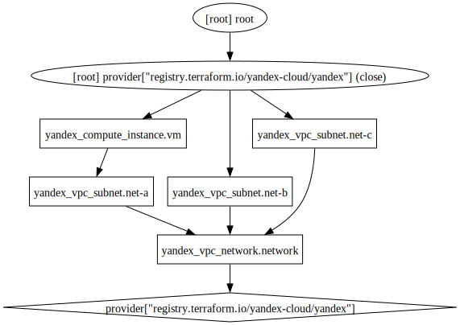

# Simple infrastructure

```bash
yc iam service-account create --name sa-tf
```

```bash
export SA_ID=$(yc iam service-account get sa-tf --format json | jq -rMc '.id')
export FOLDER_ID=$(yc config get folder-id)
yc resource-manager folder add-access-binding $FOLDER_ID  --role admin --subject serviceAccount:$SA_ID
```

```bash
yc iam key create \
  --service-account-id $SA_ID \
  --folder-id $FOLDER_ID \
  --output key.json
```

```bash
. ./init-env.sh
```

```bash
terraform init
terraform plan
terraform graph | dot -Tsvg > graph.svg
```



```bash
terraform apply -auto-approve
```

```bash
terraform destroy -auto-approve
```
